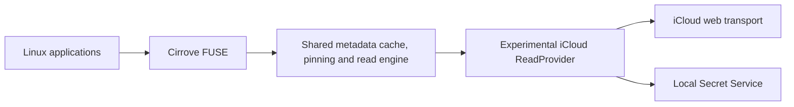

# 0016: Explore a direct Linux iCloud Drive adapter against the web transport

Status: proposed; corrected after surveying existing Linux clients and inspecting a
working Fedora/GNOME installation on 2026-09-24.

## Product goal and correction

Cirrove's goal is to show a person's **existing iCloud Drive files on Linux** in the
same provider-neutral filesystem used for OneDrive and Google Drive. A requirement
for a running Mac would not meet that goal. A Cirrove user has an existing
Fedora/GNOME installation whose iCloud files are visible and writable in Files.
Read-only inspection over Tailscale established that `~/iCloud` is a writable
`fuse.rclone` mount from `icloud:`; `rclone-icloud.service` runs it. A separate
`rclone-icloud-photos.service` exposes iCloud Photos read-only. The machine is
Fedora 44 with GNOME 50.5 and rclone 1.74.3. This is first-hand evidence for a
working Linux iCloud Drive mount, not evidence for a built-in GNOME provider or
for Cirrove's own recovery guarantees. No credentials or cloud files were read.

The first version of this ADR proposed a macOS companion because Apple does not
publish a general iCloud Drive file API. That conclusion about Apple's published
APIs remains true, but it overlooked working Linux clients. Rclone has an iCloud
Drive backend; pyicloud exposes listing, download, upload, rename and delete; and
icloud-linux builds a local-first FUSE projection. They use iCloud's web transport
rather than CloudKit. The direct Linux route is therefore technically plausible
and deserves a measured feasibility spike. The Mac companion is a fallback for a
future, separately scoped product, not Cirrove's planned iCloud route.

Apple's [CloudKit](https://developer.apple.com/documentation/cloudkit) addresses an
app's own containers and does not expose the person's general Drive tree.
[File Provider](https://developer.apple.com/documentation/fileprovider) publishes an
app's remote storage to Apple's file browsers. Neither is a substitute for the
Drive transport the existing Linux clients use.

## What the existing implementations establish

| Implementation | Evidence for existing Drive files | What Cirrove can learn |
| --- | --- | --- |
| [rclone iCloud Drive](https://rclone.org/iclouddrive/) | Direct Linux backend, FUSE mount and read/write operations | Current authentication and web request shape; opaque IDs and ETags in its [Drive backend](https://github.com/rclone/rclone/blob/master/backend/iclouddrive/iclouddrive.go) and [web transport](https://github.com/rclone/rclone/blob/master/backend/iclouddrive/api/drive.go) |
| [pyicloud](https://github.com/picklepete/pyicloud#file-storage-icloud-drive) | Lists, streams and changes files under `api.drive` | Independent confirmation of direct access, but not Cirrove's identity or recovery guarantees |
| [icloud-linux](https://github.com/IsmaeelAkram/icloud-linux) | Cached Linux FUSE filesystem with background sync | Usability patterns and conflict copies, not proof of Cirrove's provider contracts |
| User's Fedora/GNOME installation | `findmnt` identifies `~/iCloud` as writable `fuse.rclone`, with an active rclone iCloud Drive service; Files shows it as a local mount | Gives Cirrove a real Linux behavior baseline, but not a reason to reuse another client's config or mount |
| [GNOME Online Accounts](https://gnome.pages.gitlab.gnome.org/gnome-online-accounts/services.html) | The current published provider/service table has no Apple or iCloud Drive Files provider | Published upstream capabilities do not identify the backend of this user's working installation |

The GNOME table is for its current upstream implementation. The inspected Fedora
setup uses rclone FUSE, so the iCloud entry in Files does not imply a GOA iCloud
provider. Do not inspect credentials, dump account configuration, or alter the
existing rclone mounts or services. Apple's
[third-party account authorization](https://support.apple.com/121539) describes
Mail, Calendar and Contacts, which are different services from Drive files.

Rclone's backend is the most useful transport reference, but it is not a drop-in
Cirrove provider. Its code gives Drive items `drivewsid`, `docwsid`, `item_id`,
parent ID and ETag. It lists children through `retrieveItemDetailsInFolders`,
obtains a download URL by item ID and can request byte ranges. The current code
reports no content hash. It does not expose a Drive change cursor through the
backend. Its `Update` first moves the old item to Trash and then uploads a new
item, so its replacement behavior cannot be adopted for Cirrove's durable local
save contract. Its rename, move and trash helpers can retry an ETag conflict with
the new ETag when `force` is true; Cirrove must instead surface that conflict.
These are source observations, not yet live Cirrove results.

Recent [shared-folder failures](https://github.com/rclone/rclone/issues/9477) and
[2FA failures](https://github.com/rclone/rclone/issues/9730) in rclone's own tracker
show why each account class and operation needs evidence. These reports do not
prove that all accounts fail.

## Authentication boundary

Rclone's current [configuration guide](https://rclone.org/iclouddrive/) says the
web flow uses the ordinary Apple Account password, SRP and two-factor approval;
app-specific passwords do not work for Drive. It reports a trust token valid for
about 30 days, after which reauthentication is needed. Advanced Data Protection
requires web access to be enabled and may require device approval for PCS cookies.
This is not the browser OAuth grant Cirrove uses for Google and Microsoft.

Cirrove should implement an interactive, local authentication flow in which the
password and 2FA code are never logged or sent to Cirrove's servers. The password
is used in memory for the SRP exchange and discarded; the resulting session and
trust material belong in the local Secret Service vault. A fresh challenge asks
the person to authenticate again. This is a proposed design, **not** a claim that
password-free renewal works for every Apple account. Rclone stores an obscured
password in its config; [rclone itself says obscuring is not secure encryption](https://rclone.org/commands/rclone_obscure/).

The first live spike may use a separately configured, isolated rclone instance to
learn the transport without handling credentials in new Cirrove code. It must not
read or change another client's existing config. No credentials, cookies, token
values, signed download URLs or raw response bodies enter the evidence artifact.

## Direct Linux architecture if the gates pass

The adapter must return Cirrove's account + collection + item identity. Use Apple's
opaque item ID and zone, not a path, and verify their stability over rename and
move. Directory listing and change tracking must stage a complete bounded
snapshot before publishing its metadata and cursor. If Apple offers no usable
Drive change cursor, use a bounded, scheduled tree reconciliation with explicit
freshness limits; never pretend it is an incremental feed. For large directories,
prove pagination or a safe response bound before accepting the transport.

For reads, bind the item ID to a verified content revision. ETag, size and
modification time are candidates, not yet a proven content lineage. A ranged read
must reject a changed item before cache publication; an expiring download URL is
transport material, never identity or a persisted cursor. If content revision
cannot be established, return a clear error rather than serve bytes under a stale
version key. The existing cache, offline pinning, desktop state and Dolphin
integration can then remain shared.

## Milestone I0: direct Linux read feasibility

The first probe is isolated and read-only. It may inspect owned fixtures, but it
must not mutate a cloud account without a separate explicit authorization.

The Fedora/GNOME connection is already identified as rclone FUSE, so it can serve
as a read-only behavioral baseline. Do not wrap its mounted path as a Cirrove
provider: a filesystem path alone cannot supply Cirrove's account + collection +
item identity, provider revision, and version-bound read contract, and nesting
FUSE mounts would obscure ownership and recovery. The live probe should use an
isolated test configuration and account, never the existing rclone configuration,
mount or service.

1. Reproduce account sign-in and re-sign-in for a dedicated test account, with and
   without Advanced Data Protection if accounts are available. Record only success,
   failure class and elapsed time.
2. Enumerate the root, a normal folder, an app folder and a shared folder. Measure
   page/response sizes and whether complete listing is possible.
3. Check opaque item and zone IDs across a rename, move, restart and another-device
   change using owned test fixtures. Any remote mutations for these cases require
   separate authorization.
4. Read an exact small and large file, including nonzero ranges; compare hashes
   with a separately downloaded copy. Inject cancellation, stale metadata,
   expired signed URL and interrupted response.
5. Prove whether the ETag or another field distinguishes content changes from
   metadata-only changes. A same-size replacement is mandatory.
6. Establish a complete refresh method that does not lose the last visible
   metadata or completed checkpoint when interrupted. Bound both memory and
   provider requests on a large synthetic tree before any live-scale claim.

Completion means the read path can satisfy Cirrove's existing `MetadataProvider`
and `ReadProvider` contracts with stable identity, verifiable bytes and honest
freshness. A successful `rclone ls` alone is only evidence that login and listing
work. If the transport cannot meet a gate, record the exact limitation and keep
iCloud out of Cirrove's account picker.

## Writes require a separate gate

Rclone and pyicloud show that uploads, rename and deletion are possible. Their
existence does not establish Cirrove's requirements for conflict preservation and
crash recovery. In particular, rclone's current replace path trashes the old file
before uploading the replacement, and its optional ETag conflict retry updates
the precondition. Cirrove must not copy either behavior.

Each intended write needs an owned remote test item, a demonstrated stale-write
conflict, an interruption after the request but before its receipt, and exact-ID
reconciliation. If the web transport cannot offer a conditional replacement with
recoverable identity, the iCloud mount remains read-only. A local upload reaching
HTTP success is not, by itself, proof that the intended remote item now owns the
exact bytes.

## Immediate implementation sequence

1. Build a synthetic protocol fixture from documented observations of the open
   clients. Keep it isolated from live accounts and from the current provider
   crates. Do not add a dependency until its concrete use is known.
2. Run a read-only transport probe with a separate private test configuration and
   record the I0 results. This needs a test Apple Account and an interactive 2FA
   step; the current Google and Microsoft accounts are unrelated.
3. If I0 passes, add a native Rust adapter and vault-backed interactive sign-in,
   keeping the web protocol isolated behind that provider crate. Validate it
   through the shared engine and synthetic crash tests before a preview mount.
4. Only then decide whether the maintenance cost of Apple's undocumented protocol
   is acceptable for a released Linux provider. If not, document the tested
   limitation and leave the feature experimental.

This is a direct Linux strategy. Its cost is ongoing compatibility work whenever
Apple changes the web transport; no official stability promise exists. That cost
must be measured alongside the benefit of using Cirrove's stronger cache, pinning
and recovery machinery rather than maintaining a second filesystem.
