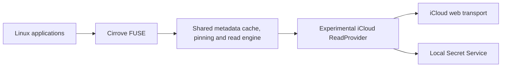

# 0016: Explore a direct Linux iCloud Drive adapter against the web transport

Status: proposed; corrected after surveying existing Linux clients and inspecting a
working Fedora/GNOME installation on 2026-09-24.

## Product goal and correction

Cirrove's goal is to show a person's **existing iCloud Drive files on Linux** in the
same provider-neutral filesystem used for OneDrive and Google Drive. A requirement
for a running Mac would not meet that goal. A Cirrove user has an existing
Fedora/GNOME installation whose iCloud files are visible and writable in Files.
Read-only inspection over Tailscale established that `~/iCloud` is a writable
`fuse.rclone` mount from `icloud:`; `rclone-icloud.service` runs it. A separate
`rclone-icloud-photos.service` exposes iCloud Photos read-only. The machine is
Fedora 44 with GNOME 50.5 and rclone 1.74.3. This is first-hand evidence for a
working Linux iCloud Drive mount, not evidence for a built-in GNOME provider or
for Cirrove's own recovery guarantees. No credentials or cloud files were read.
The 2026-09-27 read-only follow-up confirmed that the service still runs and
uses `--vfs-cache-mode full`, `--dir-cache-time 1h` and `--poll-interval 0`.
Only those allowlisted flags were read from the process command line; its
configuration, credentials, cache and mounted data were not inspected.

The first version of this ADR proposed a macOS companion because Apple does not
publish a general iCloud Drive file API. That conclusion about Apple's published
APIs remains true, but it overlooked working Linux clients. Rclone has an iCloud
Drive backend; pyicloud exposes listing, download, upload, rename and delete; and
icloud-linux builds a local-first FUSE projection. They use iCloud's web transport
rather than CloudKit. The direct Linux route is therefore technically plausible
and deserves a measured feasibility spike. The Mac companion is a fallback for a
future, separately scoped product, not Cirrove's planned iCloud route.

Cirrove's iCloud implementation must be independent: no rclone executable,
library, daemon, mounted filesystem, configuration or credentials in its runtime,
build, tests or sign-in flow. Existing clients are research references and the
Fedora mount is feasibility evidence only. Cirrove owns its protocol adapter,
authentication, metadata, reads and (if proven safe) writes.

Apple's [CloudKit](https://developer.apple.com/documentation/cloudkit) addresses an
app's own containers and does not expose the person's general Drive tree.
[File Provider](https://developer.apple.com/documentation/fileprovider) publishes an
app's remote storage to Apple's file browsers. Neither is a substitute for the
Drive transport the existing Linux clients use.

## What the existing implementations establish

| Implementation | Evidence for existing Drive files | What Cirrove can learn |
| --- | --- | --- |
| [rclone iCloud Drive](https://rclone.org/iclouddrive/) | Direct Linux backend, FUSE mount and read/write operations | Current authentication and web request shape; opaque IDs and ETags in its [Drive backend](https://github.com/rclone/rclone/blob/master/backend/iclouddrive/iclouddrive.go) and [web transport](https://github.com/rclone/rclone/blob/master/backend/iclouddrive/api/drive.go) |
| [pyicloud](https://github.com/picklepete/pyicloud#file-storage-icloud-drive) | Lists, streams and changes files under `api.drive` | Independent confirmation of direct access, but not Cirrove's identity or recovery guarantees |
| [icloud-linux](https://github.com/IsmaeelAkram/icloud-linux) | Cached Linux FUSE filesystem with background sync | Usability patterns and conflict copies, not proof of Cirrove's provider contracts |
| User's Fedora/GNOME installation | `findmnt` identifies `~/iCloud` as writable `fuse.rclone`, with an active rclone iCloud Drive service; Files shows it as a local mount | Gives Cirrove a real Linux behavior baseline, but not a reason to reuse another client's config or mount |
| [GNOME Online Accounts](https://gnome.pages.gitlab.gnome.org/gnome-online-accounts/services.html) | The current published provider/service table has no Apple or iCloud Drive Files provider | Published upstream capabilities do not identify the backend of this user's working installation |

The GNOME table is for its current upstream implementation. The inspected Fedora
setup uses rclone FUSE, so the iCloud entry in Files does not imply a GOA iCloud
provider. Do not inspect credentials, dump account configuration, or alter the
existing rclone mounts or services. Apple's
[third-party account authorization](https://support.apple.com/121539) describes
Mail, Calendar and Contacts, which are different services from Drive files.

Rclone's backend is the most useful transport reference, but it is not a drop-in
Cirrove provider. Its code gives Drive items `drivewsid`, `docwsid`, `item_id`,
parent ID and ETag. It lists children through `retrieveItemDetailsInFolders`,
obtains a download URL by item ID and can request byte ranges. The current code
reports no content hash. It does not expose a Drive change cursor through the
backend. Its `Update` first moves the old item to Trash and then uploads a new
item, so its replacement behavior cannot be adopted for Cirrove's durable local
save contract. Its rename, move and trash helpers can retry an ETag conflict with
the new ETag when `force` is true; Cirrove must instead surface that conflict.
These are source observations, not yet live Cirrove results.

Recent [shared-folder failures](https://github.com/rclone/rclone/issues/9477) and
[2FA failures](https://github.com/rclone/rclone/issues/9730) in rclone's own tracker
show why each account class and operation needs evidence. These reports do not
prove that all accounts fail.

## Authentication boundary

Rclone's current [configuration guide](https://rclone.org/iclouddrive/) says the
web flow uses the ordinary Apple Account password, SRP and two-factor approval;
app-specific passwords do not work for Drive. It reports a trust token valid for
about 30 days, after which reauthentication is needed. Advanced Data Protection
requires web access to be enabled and may require device approval for PCS cookies.
This is not the browser OAuth grant Cirrove uses for Google and Microsoft.

Cirrove should implement an interactive, local authentication flow in which the
password and 2FA code are never logged or sent to Cirrove's servers. The password
is used in memory for the SRP exchange and discarded; the resulting session and
trust material belong in the local Secret Service vault. A fresh challenge asks
the person to authenticate again. This is a proposed design, **not** a claim that
password-free renewal works for every Apple account. Rclone stores an obscured
password in its config; [rclone itself says obscuring is not secure encryption](https://rclone.org/commands/rclone_obscure/).

The first live spike must use a Cirrove-owned native Rust probe and its own private
credential store. It must not call rclone or read or change another client's
configuration, credentials, mount or service. No credentials, cookies, token
values, signed download URLs or raw response bodies enter the evidence artifact.

On 2026-09-27, a feature-gated Cirrove probe using the isolated, saved
`iCloudGuiValidation` session successfully created a uniquely named test folder
and one small ordinary file in it, confirmed their returned provider identities,
and read the file back byte for byte. The [pre-registered run artifact](../benchmarks/icloud-write-fixture-2026-09-27.md)
records the scope and elapsed time. No pre-existing user item was changed. This
supports the **new-file** request shape for one account; it says nothing yet
about safe overwrite, conflict detection, delete, or long-term reliability.

## Direct Linux architecture if the gates pass

```mermaid
flowchart LR
    Apps[Linux applications] --> FUSE[Cirrove FUSE]
    FUSE --> Engine[Shared metadata cache, pinning and read engine]
    Engine --> Adapter[Experimental iCloud ReadProvider]
    Adapter --> Web[iCloud web transport]
    Adapter --> Vault[Local Secret Service]
```

The adapter must return Cirrove's account + collection + item identity. Use Apple's
opaque item ID and zone, not a path, and verify their stability over rename and
move. Directory listing and change tracking must stage a complete bounded
snapshot before publishing its metadata and cursor. If Apple offers no usable
Drive change cursor, use a bounded, scheduled tree reconciliation with explicit
freshness limits; never pretend it is an incremental feed. For large directories,
prove pagination or a safe response bound before accepting the transport.

For reads, bind the item ID to a verified content revision. ETag, size and
modification time are candidates, not yet a proven content lineage. A ranged read
must reject a changed item before cache publication; an expiring download URL is
transport material, never identity or a persisted cursor. If content revision
cannot be established, return a clear error rather than serve bytes under a stale
version key. The existing cache, offline pinning, desktop state and Dolphin
integration can then remain shared.

## Milestone I0: direct Linux read feasibility

A [native Rust read probe](../icloud-native-probe.md) now implements an
interactive SRP/trusted-device sign-in, bounded root/folder listing and a bounded
small-file read by opaque ID without any rclone dependency. Its SRP proof,
endpoint validation and metadata parsing have local tests. It has **not** yet
completed the full I0 gate. One real account has passed sign-in, root listing
and a small file download through the native probe. A nonzero range matched a
saved complete file, and a keyring-backed session resumed in a separate process
without another password or code prompt. Revision semantics, complete refresh,
renewal after expiry and account-class coverage remain open. An experimental
read-only account path, command and desktop picker now exist on the draft branch,
but no iCloud account has been mounted through the installed service.

The first probe is isolated and read-only. It may inspect owned fixtures, but it
must not mutate a cloud account without a separate explicit authorization.

The Fedora/GNOME connection is already identified as rclone FUSE, so it establishes
that direct Linux access is possible. Do not wrap, call or test through its mounted
path: a filesystem path alone cannot supply Cirrove's account + collection + item
identity, provider revision, and version-bound read contract, and nesting FUSE
mounts would obscure ownership and recovery. The live probe must use Cirrove's
native transport and independent sign-in, never the existing rclone configuration,
mount or service. The same Apple account may be used only through that separate
Cirrove sign-in; a new Apple account is not a prerequisite for the read probe.

1. Reproduce account sign-in and re-sign-in for a dedicated test account, with and
   without Advanced Data Protection if accounts are available. Record only success,
   failure class and elapsed time.
2. Enumerate the root, a normal folder, an app folder and a shared folder. Measure
   page/response sizes and whether complete listing is possible.
3. Check opaque item and zone IDs across a rename, move, restart and another-device
   change using owned test fixtures. Any remote mutations for these cases require
   separate authorization.
4. Read an exact small and large file, including nonzero ranges; compare hashes
   with a separately downloaded copy. Inject cancellation, stale metadata,
   expired signed URL and interrupted response.
5. Prove whether the ETag or another field distinguishes content changes from
   metadata-only changes. A same-size replacement is mandatory.
6. Establish a complete refresh method that does not lose the last visible
   metadata or completed checkpoint when interrupted. Bound both memory and
   provider requests on a large synthetic tree before any live-scale claim.

Completion means Cirrove's own read path can satisfy its existing `MetadataProvider`
and `ReadProvider` contracts with stable identity, verifiable bytes and honest
freshness. A successful `rclone ls` alone is only evidence that login and listing
work. If the transport cannot meet a gate, record the exact limitation and keep
iCloud out of Cirrove's account picker.

## Writes require a separate gate

Rclone and pyicloud show that uploads, rename and deletion are possible. Their
existence does not establish Cirrove's requirements for conflict preservation and
crash recovery. In particular, rclone's current replace path trashes the old file
before uploading the replacement, and its optional ETag conflict retry updates
the precondition. Cirrove must not copy either behavior.

Each intended write needs an owned remote test item, a demonstrated stale-write
conflict, an interruption after the request but before its receipt, and exact-ID
reconciliation. If the web transport cannot offer a conditional replacement with
recoverable identity, the iCloud mount remains read-only. A local upload reaching
HTTP success is not, by itself, proof that the intended remote item now owns the
exact bytes.

### Write gate after the native read preview (2026-09-27)

The native iCloud adapter currently implements only `MetadataProvider` and
`ReadProvider`. Cirrove's durable `UploadProvider` and `MutationProvider` workers
already exist. The iCloud work is to prove and implement their provider-specific
contracts, while every iCloud account remains read-only.

Current upstream [transport code](https://github.com/rclone/rclone/blob/master/backend/iclouddrive/api/drive.go)
demonstrates `createFolders`, `renameItems`, `moveItems`,
`moveItemsToTrash`, `/upload/web`, and `/update/documents`. The
namespace calls carry an item ETag and can report `ETAG_CONFLICT`. Rclone's
optional `force` path retries with the newer ETag; Cirrove must instead retain
the local intent as a conflict. Its [file replacement path](https://github.com/rclone/rclone/blob/master/backend/iclouddrive/iclouddrive.go)
trashes the existing
item before a new upload, and the document update request uses `add_file` with
`allow_conflict: true` and no original-item ETag. Neither path proves a safe
same-identity, conditional content replacement. These are source-code
observations, not live Cirrove mutation evidence.

Advance through these gates in order, using only Cirrove-owned test items in an
isolated account state. A cloud-mutating live run needs separate explicit task
authorization and a registered measurement protocol:

1. Add a native, disabled write transport and synthetic fault fixtures. Validate
   exact account/zone/item IDs, response status, ETag conflicts, bounded uploads,
   signed URL validation, and cancellation. Persist the upload identity/session
   checkpoint before any mutating request. Do not add a UI write toggle yet.
2. On a run-owned fixture, test creation of a new file and folder, then resolve
   an intentionally lost response by exact identity and exact content bytes. A
   same-name sibling is never sufficient proof of success.
3. Determine whether an existing file can be replaced in place under a stale
   revision precondition. Test an unchanged base, a different-device edit before
   commit, a same-size content change, and a response lost after commit. Confirm
   identity and full content hash independently. A preflight ETag read is
   insufficient if the commit itself ignores the stale precondition.
4. Test exact-ID conditional rename, move and trash, including stale ETags,
   destination collisions, repeated requests and interrupted receipts. Folder
   removal must verify emptiness and acknowledge that a list-then-delete window
   may remain non-atomic; never implement it as unchecked recursive trash.
5. Connect only proven operations to the existing journal and FUSE writer in a
   disabled, isolated mount. Exercise ordinary editor atomic saves, offline
   restart, conflicting remote edits, quota/permission errors, expired sign-in,
   large files and shared/app folders. Preserve local bytes until a verified
   receipt; demonstrate recovery after process death at every boundary.

The decisive gate is step 3. If Apple's web transport cannot atomically refuse
a stale content replacement and reconcile an uncertain result by stable identity,
Cirrove must not offer general writable iCloud mounts. A narrower, explicitly
labelled create-new-only experiment may still be possible, but it is not full
write support. Apple's general Drive web transport has no published stability
contract, so even a passing single-account test remains experimental until
repeated and account-class validation is complete.

### Refined route if the web transport has no in-place overwrite

The Fedora machine's actual rclone version,
[1.74.3](https://github.com/rclone/rclone/blob/v1.74.3/backend/iclouddrive/iclouddrive.go),
trashes the previous remote item before beginning an upload. Its VFS `full`
mode makes editor writes locally compatible and [writes them back after close](https://rclone.org/commands/rclone_mount/);
that is not a remote compare-and-swap. [pyicloud](https://github.com/picklepete/pyicloud/blob/master/pyicloud/services/drive.py)
only implements a new-file `add_file` upload; [icloud-linux](https://github.com/IsmaeelAkram/icloud-linux/blob/master/driver.py)
also deletes the old remote item before uploading its dirty file. The independent
[idrive-cli notes](https://github.com/nktknshn/idrive-cli#upload) explicitly say
the web path cannot overwrite and remove the old item first. None of these
sources proves that a safer private request is impossible, but none supplies
the same-ID conditional replacement Cirrove currently requires either.

Before attempting a fallback, run a disabled, run-owned probe of Apple's
`update/documents` request. Try an existing document ID with conflict creation
disabled, and compare unchanged versus deliberately stale revisions. Check
whether Apple retains the document/Drive ID and either rejects stale content or
creates a separate conflict version. Do not infer semantics from the request's
`allow_conflict` name; verify the final bytes and both identities independently.

The [unchanged-base trial](../benchmarks/icloud-same-id-update-2026-09-27.md)
found a same-ID update that returned exact revised bytes. The subsequent
[stale-ETag trial](../benchmarks/icloud-stale-etag-2026-09-27.md) used the same
request shape with `allow_conflict: false` and the original ETag after a first
update. Apple accepted the stale request and exposed the second candidate
bytes under the same ID. The direct same-ID route therefore fails Cirrove's
conflict gate for this request shape and cannot be enabled for general writes.
This is one account and one request shape, not a proof that every undocumented
Apple mechanism lacks a conditional replacement.

Two follow-up rename trials narrowed the namespace question. A rename with
an ETag made stale by a content update was [accepted](../benchmarks/icloud-conditional-rename-2026-09-27.md).
A metadata-only trial then renamed the file once, observed a new ETag, and
submitted a second rename with the pre-rename ETag; that too was
[accepted](../benchmarks/icloud-metadata-rename-etag-2026-09-27.md), with the
same item ID and bytes. The known `renameItems` request shape therefore also
fails the conditional namespace gate on this account. Rclone's branch for
`ETAG_CONFLICT` cannot be treated as proof that every stale ETag is rejected.
Cirrove must not wire these requests into its current conditional mutation
contract.

A separate [HTTP `If-Match` trial](../benchmarks/icloud-http-if-match-2026-09-27.md)
put the stale ETag in a standard conditional header as well as the JSON body.
Apple still accepted the same-ID content update and exposed the candidate
bytes under the original ID. This closes another plausible request variant
for this account. The next write work must preserve versions independently
of any assumed web-API ETag enforcement; direct overwrite remains disabled.

The following remains only a *non-atomic, conflict-preserving research
candidate*, not an implementable safe write protocol yet. The two rename trials
show that the known ETag parameter does not provide the required conditional
move of the old item. A design that uses it as a compare-and-swap is invalid:

1. Upload new bytes under a unique temporary name without touching the old
   item. Persist the new exact ID and upload receipt first, then read it back
   and verify its full hash.
2. Re-read the old exact ID, revision and content. Any subsequent rename to a
   recovery name is currently **unconditional** on that revision. It could
   move a concurrent remote edit, so preserve that item as a recovery copy and
   record this as a conflict, never assume the preflight protected it. A
   genuinely conditional operation or an equivalent non-destructive mechanism
   still needs to be found and proven before ordinary writeback is enabled.
3. Move/rename the verified new item into the original name. If that fails or
   its response is lost, reconcile both exact IDs and preserve the old recovery
   item. Do not decide success by a matching path or file size.
4. Never automatically retire the old recovery item under the currently known
   request shapes. A crash at every transition must be restartable without
   reuploading under an unknown identity; user-visible conflict resolution
   would be required before any old version could be removed.

This protocol has a visible interval when the original path is absent or held
by another name, and concurrent clients may create a destination collision.
It also changes the remote item ID. Cirrove's current upload journal explicitly
requires `UploadIntent::Replace` to acknowledge the *same* remote ID, so this
fallback needs a new, provider-neutral identity-handoff operation and mounted
application tests. It could preserve both versions without pretending to offer
atomic POSIX replacement; it cannot be called full parity until its limitations
are reflected in the product and pass live conflict, crash, folder and account
class validation. The preferred path remains a proven conditional in-place
update if the Apple web transport offers one.

## Immediate implementation sequence

1. Build a synthetic protocol fixture from documented observations of the open
   clients, without copying their implementation. Keep it isolated from live
   accounts and from the current provider crates. Add only dependencies needed by
   this concrete native probe.
2. Implement a Cirrove-owned, read-only Rust transport probe with private vault
   storage and interactive Apple sign-in/2FA. Run I0 through that probe and record
   the results. The existing Apple account can be used after separate Cirrove
   sign-in; the current Google and Microsoft accounts are unrelated.
3. Continue validating the native Rust adapter behind the existing provider
   contracts. Synthetic shared-engine tests pass, but the isolated preview mount
   and installed account flow still need live evidence before a release claim.
4. Only then decide whether the maintenance cost of Apple's undocumented protocol
   is acceptable for a released Linux provider. If not, document the tested
   limitation and leave the feature experimental.

This is a direct Linux strategy. Its cost is ongoing compatibility work whenever
Apple changes the web transport; no official stability promise exists. That cost
must be measured alongside the benefit of using Cirrove's stronger cache, pinning
and recovery machinery rather than maintaining a second filesystem.
