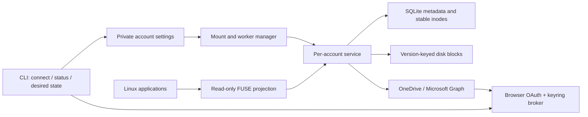

# Architecture

## Product contract and current boundary

Cirrove makes remote files usable through ordinary Linux applications. Cached
metadata should stay available when a provider is slow; file bytes arrive on demand.
The current implementation is a **read-only preview under validation**. Ordinary mounts do not
upload through mounted paths or pin files. A separate experimental constructor
now exercises local writes and offline recovery on isolated synthetic FUSE mounts. A separate
upload journal and worker protect sealed edits, persist resumable Graph sessions
through the keyring, and reconcile uncertain attempts. They have synthetic HTTP and
crash coverage; broader live-provider checks and writable application-save integration remain in
progress. See
[durable local edits](adr/0002-durable-local-edits.md).

A cloud API cannot provide instant uncached access or complete local POSIX semantics.
The service reconciles metadata using incremental delta feeds. OneDrive Socket.IO
notifications now wake those feeds, while polling continues at 30 seconds by default
as a safeguard. A notification is a hint to fetch changes, not file content or proof
that the visible index is current. Provider delivery can itself be delayed; this is
not an instantaneous real-time guarantee. See [change notifications](adr/0003-change-notifications.md).

## Identity and linked libraries

A scope is `(account, provider, collection)`; Graph collections are drive IDs.
Item IDs are identity, while names and parents are mutable presentation. A shortcut
retains its target drive/item and target kind. Duplicate projections receive distinct
inodes, while cached bytes share the same remote identity and version. Directories
retain their inodes; regular-file inode keys additionally contain the content revision
and size to separate kernel pages belonging to different versions. A metadata-only
rename reuses the inode and bytes when a provider content tag is available.

Graph packages, such as OneNote notebooks, are projected as read-only child containers.
They have neither a file nor a folder facet; treating that as a malformed entry would
abort a whole delta page or directory. This projection does not implement OneNote
editing or claim compatibility with native notebook applications.

Discovery follows indexed ancestry and starts one delta worker per linked drive.
Reachable roots are persisted; obsolete subscriptions are removed only when the
remaining reachable scopes have complete indexes. Discovery stops at duplicate roots
and limits traversal to 256 roots. Projected ancestry detects cycles and excessive
depth. Invalid/cyclic entries currently produce generic projection warnings; polished
per-entry UI feedback is future work.

A failed linked-drive feed does not stop the primary drive. Cached metadata remains
last-known data. A folder shared without permission to enumerate its entire backing
drive may need foreground directory requests; this case is not claimed as verified
until tested with a real tenant. A cache is not proof of current remote authorization.

## Atomic metadata and foreground observations

Each collection has an optional provider notification session, independently of its
delta worker. A bounded generation signal retains hints received during a refresh.
The worker consumes the generation before starting network work and coalesces bursts
with at least 250 ms between refresh starts. Failed refreshes retain their backoff;
push cannot bypass Retry-After. A single coalescing discovery task prevents push
bursts from accumulating linked-library discovery tasks.

OneDrive obtains the signed Socket.IO endpoint through authenticated Graph, then
uses a separate Rustls WebSocket connection without Graph bearer headers. Engine.IO
heartbeats detect silent disconnects; namespace acknowledgement is required before
reporting connected. The service retries failed subscription attempts and each
successful connection requests a catch-up delta. A healthy session renews after
50 minutes. Message/frame limits and cancellation bound socket work. Connection
state is visible per feed in the status response; it is separate from metadata
freshness. An isolated business-drive check passed the actual renewal and a new
notification afterward; personal accounts and recovery after suspend/network loss
remain live validation gates.

The store stages paginated changes and advances the continuation in one transaction.
Visible nodes and the completed cursor change together only on the terminal page.
A replacement baseline is built alongside the last visible index. Interrupted work
resumes; an expired cursor does not immediately empty a usable directory tree.

Cold foreground listings are atomically recorded separately from the delta index.
Metadata schema 4 assigns a persistent logical revision before each network
observation and feed round; completion wall time is used only for age reporting.
Publication checks the observation's ticket against intervening commits for that
item, its affected directories and its scope. A superseded response yields the
current committed view. If a complete directory view is still unknown, the engine
retries from the first page, at most three times within the total listing deadline.
An item with no current view returns ESTALE rather than discarded metadata.

An incremental round invalidates older observations for changed identities and
their affected parents; an empty or unrelated delta keeps fresher directory
listings. A replacement baseline removes observations whose requests started
before that round. Observations started afterward remain visible across its commit.
Single-item observations overlay cached directory snapshots, including both sides
of a move. A complete listing's absent children are hidden by separate negative
observations; this does not remove rows from the committed delta baseline or claim
that an absent item was deleted remotely. Later observations or feed rounds can
supersede that absence. Directory reads use one database snapshot so their base,
positive observations and negative observations agree.

A single-item NotFound response uses the same ticket ordering. It hides the cached
entry without modifying the completed baseline. A newer positive observation or
complete parent listing supersedes an older NotFound response, so a delayed failure
cannot remove a file that a later request has already observed.

The schema migration preserves existing metadata and seeds the logical clock from
legacy ordering values. The observation database remains separate from the upload
journal. This ordering prevents local publication races; it cannot establish a
globally consistent snapshot across an eventually consistent provider's endpoints.

Reading a directory registers a 60-second activity lease. Each account retains at
most 32 recently used directories and has one revalidation worker, with at least
two seconds between listing starts. A successful listing becomes due again after
five seconds; multiple directories share that budget, so this is not a five-second
freshness guarantee. Background checks do not renew their own lease. The service
knows filesystem activity, not whether a file-manager window stays visible.

Cached listings return immediately while that worker fetches updates. Per-directory
gates coalesce cold foreground work with background checks. Unchanged results do
not emit another filesystem invalidation. Backoff survives repeated directory use;
throttling and authentication failures also postpone other background listings in
the account. Status exposes active, refreshing and delayed directory counts.
Directory fetches have a 60-second total deadline and repeated-cursor/entry limits.
Each listing can require multiple provider pages. The single worker can use one
of the existing foreground metadata slots, leaving capacity for other navigation;
it never starts content downloads. This behavior is shared by provider adapters.

SQLite uses WAL and FULL synchronous mode. Network awaits never occur inside its
transactions. Database work runs on blocking workers. Shortcut discovery starts
at a partial index of actual links and follows their ancestors, so an idle poll
does not walk every file in a large library. Batched inode assignment avoids a
separate database transaction for every directory entry.

## Authentication and ownership

Microsoft authorization code flow uses PKCE S256, random state and nonce, a bound
loopback callback, explicit account selection and validated RS256 OIDC claims.
Issuer, audience, tenant, expiry and nonce are checked before an identity is accepted.
The CLI displays the verified identity and selected drive before saving it.

Non-secret configuration is atomically written and fsynced. Tokens are stored in a
Cirrove-labelled Secret Service item over an encrypted session, never in the metadata
database. Secret writes are explicitly set and read back through a fresh encrypted keyring
session before reporting success. A mismatched readback gets at most three write
attempts; lock and transport errors return to the caller. The shared account broker
serializes refresh, checks the refreshed Graph identity and persists rotation before returning a new access token. Delayed 401s
invalidate only the rejected token, not a newer grant.

A daemon ownership lock prevents competing managers. Per-account leases cover its
worker and filesystem lifetime. Reauthentication first disables that account and
waits for its lease. It verifies the same identity before replacing credentials.
Other accounts keep running. A killed login command can leave that account disabled;
`enable` is the explicit recovery action.

## Transport, responsiveness and content consistency

Persistent reqwest clients reuse connections. Authenticated Graph requests do not
follow redirects; continuation URLs must stay on the configured origin and drive.
Signed downloads use a separate client without Graph bearer headers. Provider bodies,
tokens, signed URLs and opaque cursor material are excluded from application errors.

Per account, there are four foreground metadata slots, four content slots, two
upload slots and one background metadata slot. Transfers cannot occupy directory
request slots. Upload fragments are bounded to 5 MiB and use a separate client that
neither follows redirects nor sends Graph bearer tokens to session URLs.
429/503 cooldown applies across metadata, download and upload operations. Requests and
credential operations have finite deadlines; account cancellation interrupts them.
The scheduler distinguishes authentication, permissions, missing items, expired
cursors, throttling and transient failures, and uses bounded backoff with jitter.

Content cache keys include account, drive, item, version, size and block offset.
Blocks are at most 4 MiB, while an individual read result is capped at 8 MiB. Four
loaders and eight in-memory cache blocks bound content buffering independently of the
remote file's total size; namespace and outstanding application buffers add memory.
A small failure cooldown prevents coalesced failures from becoming a retry storm.

Each uncached Graph range currently uses metadata checks before and after download.
The content revision and size must match the opened version. Cirrove prefers Graph's
content-only cTag and falls back to eTag when absent; the two tag namespaces are
distinct in cache keys. Response range and byte count are
validated before publication. This favors version consistency but adds **two Graph
metadata requests per uncached block**; real-provider latency measurements must guide
future optimization. A changed file yields ESTALE instead of mixing versions.

Blocks have SHA-256 checksums. Temporary bytes and the containing directory are
fsynced before publication is indexed. Startup removes interrupted temporary blocks,
accounts for orphaned publications and enforces quota. Corrupt blocks are fetched
again. Cached data survives restart, but unpinned blocks may be evicted: this is not
an offline-availability guarantee.

## FUSE and lifecycle

The pure-Rust `fuser` adapter uses the Linux FUSE protocol and `fusermount3`, without
libfuse development headers. Callbacks dispatch work to Tokio and keep namespace
locks short. Directory handles have stable listing snapshots. File handles bind a
content version. Ordinary read calls use kernel direct I/O. Mount initialization
requires `FUSE_DIRECT_IO_ALLOW_MMAP` to support shared read-only and private mappings;
mapping pages occupy kernel/application memory in addition to Cirrove's block cache.
The disk quota is not a limit on total kernel or application memory.

Metadata commits invalidate known paths and attributes. Pages of an older file inode
remain associated with that revision, so an existing mapping never silently reads
bytes from its replacement. An uncached old block cannot be retrieved after the
provider changes that file: reads return ESTALE, and a failing mapped page fault may
deliver SIGBUS to the application. Historical-version downloads are not implemented.
Already cached old bytes remain readable while retained; cache eviction is still
possible. This does not guarantee indefinite snapshots of open files.

The filesystem admits at most 1,024 content requests and runs 32 at a time. Additional
admitted reads await capacity asynchronously for at most 30 seconds; queue expiry is
ETIMEDOUT and admission overflow is EAGAIN. Account cancellation releases active and
queued reads with ENODEV. Content loaders remain limited to four. Metadata requests
have a separate 128-slot budget, so content contention does not consume those slots.
Namespace views are currently retained until unmount; long-session namespace growth
must be measured separately from the bounded content cache.

This first projection has read-only permissions and rejects write opens. File-manager
thumbnail generation still causes real content reads; reserved metadata capacity
prevents those requests from consuming folder-request slots. Thumbnail policy,
pinning and per-file status presentation remain later desktop work.

The manager retains running accounts if settings or mount-state observation fails.
Every mount attempt checks for an empty real directory outside other FUSE mounts.
It never mounts over local files deposited after an ejection. Enabled accounts are
remounted after accidental ejection; `disable` records an intentional unmount.
Shutdown cancels and awaits workers, then unmounts and joins FUSE sessions.

The mount root currently has fixed synthetic attributes. Metadata notifications
invalidate projected child entries, but do not invalidate that root inode: an
invalidation racing its first GETATTR can discard the initial ownership/permission
reply. Directory handles do not request kernel readdir caching. If root attributes
become mutable, their refresh needs an initialized-root lifecycle rather than
reintroducing that startup race.

Linux lazy unmount leaves the kernel connection alive while an application retains
a file or directory descriptor. Cirrove therefore retains its own connection's
FUSE control descriptor when mounting, detaches the mount, disconnects that kernel
connection and joins its request threads. The control identity comes from the
session's device fdinfo, or the exact owned mount's device number on older kernels;
it is never rediscovered by path at shutdown. Acquiring the control descriptor is
a mount prerequisite, and missing control access is reported explicitly. This
closes the read-only session even when a preview or shell retains a handle. The
experimental writable-session owner first drains accepted edits and seals dirty
working files; disconnecting is not upload acknowledgement. See
[Linux FUSE connections and control](https://docs.kernel.org/filesystems/fuse/fuse.html).

After a process crash, startup checks a stale control socket under the daemon's
ownership lock and removes it only when a connection is refused. A disconnected
FUSE mount is detached only if its filesystem type and account UUID match and
the kernel reports ENOTCONN. A live mount is never displaced. Kernel tests kill
a synthetic mount process and verify that a new manager serves readable files.
These checks do not imply that a full-machine power-loss test has passed.

## Conditional namespace changes

The provider-neutral mutation contract supports folder creation, rename/move within
one collection, and conditional regular-file removal. Rename/move sends the original
ETag and refuses destination collisions. File removal checks the remote file facet
and original ETag before issuing a conditional DELETE; a fabricated local file type
cannot turn this path into recursive folder deletion. Shortcuts and root changes
are rejected by the current mutation contract.

Upload-journal schema 3 introduced namespace records and a shared sequence/resource queue.
Metadata changes cannot overtake pending uploads on the same remote identity;
source/destination name reservations also order colliding creates and moves.
Case folding is a conservative queue exclusion, not a definition of the provider's
filename equivalence. Receipts and queue completion commit together. Migration
preserves existing upload sequence numbers, snapshots and pending states. Older
binaries refuse newer schemas instead of trying to downgrade them.

After interruption, a namespace operation requires verification. A matching immutable
item at the requested new name/parent can complete a lost rename/move response.
An unchanged original revision permits a new conditional attempt. A missing item
alone does not establish deletion: lost deletes and unidentified folder creations
can enter `NeedsReview`, retaining their request without an automatic retry loop.
HTTP success is required for a confirmed deletion receipt. File DELETE uses the
provider's recycle-bin behavior; it is not permanent deletion or local POSIX rmdir.

Experimental writable mounts now connect regular-file rename/move to this worker.
The writable namespace layer must add ancestor/dependency handling and safe
replacement semantics before enabling folder mutations through FUSE. Personal
accounts, permissions changes and broader live concurrency still require coverage.

## Experimental local working files

Schema 5 adds mutable working files alongside immutable upload snapshots. Hydration
reserves its declared logical size against the same spool quota before downloading.
The reserved file is filled with bounded, version-checked chunks outside the journal
and namespace locks. Partial sources never become visible working files. Publication
fsyncs the bytes and directory before inserting their identity and local name.
Orphans after a crash remain counted and require later recovery/cleanup handling.
This logical quota does not guarantee available physical disk space.

Before changing a working file, its journal record becomes dirty durably. A failed
write or metadata update cannot leave edited bytes marked as an unchanged cache.
`fsync`, synchronous writes and closing a write handle seal a complete immutable
snapshot. Its queue insertion and the working file's latest-generation link commit
in the same transaction. Closing a read-only preview does not seal another
application's unfinished edit. Local-save success is not cloud acknowledgement.

Consecutive upload generations form a linear dependency chain. A later generation
uses the preceding validated receipt's item ID and ETag, including after a create
assigns a new remote identity. An uncertain or conflicted predecessor blocks its
successors while independent files remain eligible. Old sealed bytes never change
when the working file is edited again. Schema 6 extends this receipt chain across
uploads and namespace mutations. A local working-file relocation now commits its
new name and queued mutation together. Schema 7 adds separate local object identity,
directory entries, confirmed remote bindings and optional working bytes. Atomic
replacement still needs integration before the full application workflow is enabled.

The developer constructor requires a disabled test account with explicit write
access and a journal owned by that account. It supports regular-file create,
write, append, truncate, flush and fsync. Working metadata overlays the cached
remote namespace, so dirty local content stays visible across offline restart.
The normal manager continues to construct read-only filesystems. No application
save on the user's ordinary mount is routed through this experimental path.

Experimental writable inodes retain identity while their local bytes change.
Memory mapping is currently disabled for these sessions; read-only sessions keep
their existing content-version inode and mapping behavior. Writable directory operations,
atomic replacement, permission/time changes and conflict UI are not connected to
writable mounts yet. Sealing may require space
for both the working file and its snapshot; failure
keeps the dirty source and reports an error. Physical power loss, physical disk-full
recovery and sustained real-provider application editing remain acceptance gates.

## Experimental writable-session ownership

`WritableSession` owns a test engine, its FUSE session, two upload workers, one
conditional namespace worker and one local-copy maintenance worker. Successful
sealing, relocation and confirmed receipts
wake the workers; a one-second fallback revisits persisted
retry deadlines without resetting backoff. Saves finish after durable local
publication, independently of cloud acknowledgement. Paginated journal records
expose each generation's state and fragment progress; desktop presentation and
durable actionable error details remain work for the product integration.

Shutdown atomically stops admission of mutating FUSE callbacks and cancels external
work. It waits for every previously admitted callback, then fsyncs and seals dirty
working files. Provider calls and keyring operations are cancellable at the service
boundary, including adapters that fail to observe the supplied token. Workers stop
before the owned kernel connection is detached and disconnected. If a snapshot
cannot be sealed, shutdown still stops the session, returns an error and retains
the dirty working bytes. No network await occurs under the journal lock.

This drain can wait for local disk work: stopping cloud requests does not authorize
discarding an accepted local write. Dropping the session without awaiting its explicit
shutdown is treated as interruption, not successful draining. Restart recovery
retains durable snapshots and dirty working copies. The ordinary account manager
does not select this experimental owner yet.

## Interleaved saves and namespace changes

A single successor relation spans upload and mutation records. It prevents two
different edits from adopting the same predecessor as if both followed it directly.
Neither worker can claim an unresolved descendant. Before selecting more work,
bounded preparation binds ready operations to their confirmed item IDs and ETags
and reserves the resulting identity/name resources. Uncertain or conflicted
operations keep their descendants pending while unrelated files remain eligible.

Working-file relocation seals dirty source bytes, then commits the new local name,
latest-operation pointer and remote mutation intent in one transaction. A failed
transaction keeps the old name and does not consume the predecessor relation. A
collision with another working copy is refused; replacement semantics are still
separate work. Relocating an already clean working copy creates no content snapshot.
Its original provider metadata is retained separately from the local content tag.
Legacy working copies with a lost original content tag cannot invent that evidence.

A successful conditional mutation response supplies a new base. Reconciliation
after a lost rename response needs an additional check: the same item at the desired
path might already contain somebody else's edit. Changed size or content revision
becomes a conflict, and missing proof becomes `NeedsReview`; neither result completes
the operation queue or authorizes a later upload against that newer ETag. Matching
content revision/size or an unchanged metadata version allows the chain to continue.
Observed receipts remain available for review without being treated as confirmed
save bases. Providers must distinguish conditional responses from later observations.

These APIs establish journal ordering and working-file transactions. The sparse
namespace model below connects regular-file relocation to FUSE. Directory dependencies,
open-unlinked handles and atomic replacement through FUSE remain required. The ordinary
manager stays read-only.

## Sparse local namespace and mounted relocation

Journal schema 7 separates stable local objects, directory entries, confirmed remote
identities, operation bindings and optional working-file bytes. A metadata-only
rename or move needs no content reservation or download. Its desired path and
queued intent commit together with an optimistic object revision check. Hydrating
that object later attaches bytes to its current local path and identity, including
when another file has since reused its original name. Truncation to zero retains
the original remote version as a write precondition without copying its old bytes.

Schema migration retains earlier acknowledged remote bindings even when a newer
save is still pending. A receipt updates the remote alias in the same transaction
as operation acknowledgement. Remote IDs assigned to newly created files do not
replace their local identity or inode. The sparse namespace currently permits at
most 10,000 objects. Fully acknowledged objects can release their working bytes and
follow later remote metadata, as described below. Their aliases and operation
history remain retained; total-object limits and memory use still need work for
long-term use with large libraries.

The mount loads a memory projection of these objects and working-file records.
Publication is atomic and revision-ordered, so a delayed save or rename callback
cannot restore an older name or discard a newer remote binding. Cached namespace
reads do not take the spool/journal mutex. The database and memory projection use
the same listing logic, suppressing old remote aliases and retaining foreign name
occupants as explicit conflicts. The developer session exposes those conflicts and
paginated mutation state; desktop conflict presentation is not implemented.

The journal supports an immutable case-sensitive or case-insensitive name policy
per collection. Existing experimental working-file calls default to case-insensitive
comparison. The current mounted preflight conservatively compares names without
case; future provider adapters must supply their own verified name semantics.

Regular-file rename/move is admitted and drained with other local mutations. It
rechecks the source name and parent at the journal serialization point. The current
path rejects cross-collection or cross-shortcut-projection moves, directory and
shortcut mutations, exchange/whiteout flags and replacement of an occupied path.
`RENAME_NOREPLACE` is supported. A remote collision after local acceptance becomes
an operation conflict; it does not authorize overwriting that occupant.

Experimental mounts require `FUSE_ATOMIC_O_TRUNC`. Without that capability Linux
can strip O_TRUNC from OPEN and issue SETATTR afterward, causing the old file to be
hydrated unnecessarily. The supported path creates empty working bytes directly
and preserves the source metadata. Read-only O_TRUNC combinations are rejected;
writable memory mapping and other attribute changes remain outside this preview.

## Acknowledged working-copy retirement

Journal schema 8 distinguishes active local objects from aliases that follow remote
metadata. An active object owns its local directory entry and any working bytes.
After every attached operation is acknowledged, no newer dirty generation exists
and no application is using the file, maintenance can detach the local entry and
working copy. The alias retains the same local identity and revision but takes its
visible name, parent and content metadata from the remote index. Later remote
changes and deletions therefore become visible instead of being masked by an old
local copy. The next edit reactivates the object using the newly observed provider
version; it cannot inherit the obsolete pre-retirement save base.

Open handles and in-flight file callbacks hold per-object access leases, including
read-only previews of edited files. Maintenance checks idleness before requesting
metadata but releases exclusive access during the request. Afterward it reacquires
exclusive access and checks the durable object revision and acknowledged frontier.
A new open or edit during that request prevents an obsolete candidate from being
retired. Publication validates the memory projection before committing the detach,
then applies it while both local locks remain held. Retaining the alias revision
prevents delayed callbacks from reinstating retired working bytes.

The detach and explicit cleanup intent commit together. Physical removal verifies
the private working file, deletes and fsyncs its directory, then clears the cleanup
intent. Restart can finish either side of an interrupted deletion. Unknown spool
files remain retained and quota-accounted. A separate bounded collector removes
only acknowledged immutable upload payloads, retaining their receipts and lineage.
Pending, uncertain, failed and conflicted payloads remain protected.

Each maintenance pass checks at most 16 active objects and requests metadata for at
most one candidate. It reuses cached metadata only when it matches the confirmed
receipt; otherwise it requests an ordered item observation with a 30-second deadline.
An accepted NotFound observation releases an acknowledged overlay of a missing
remote item without preserving a ghost entry. Provider failures keep the local copy
and have per-object retry delays up to 60 seconds. Background work also has a quiet
interval, and wake notifications cannot bypass failure delays. The worker repairs
missed local projection updates from durable records without replaying provider
operations. It participates in session cancellation and shutdown.

This releases working storage, not all historical metadata. Aliases are still
loaded into the in-memory projection, and operation history has no retention policy
yet. Pins, writable mappings and complete application-save semantics remain separate
acceptance gates. Ordinary daemon mounts still use the read-only constructor.

## Next boundaries

Before enabling writes, connect the local upload journal to application-save
ordering, conditional writes, resumable uploads and conflict preservation. The
standalone journal tests do not prove writable filesystem semantics. Separate
local-save success from remote acknowledgement. GTK settings, tray and Nautilus integrations
must consume the service's state rather than maintain their own sync logic.

Google Drive will implement provider contracts around its native changes and content
APIs, including shared drives and explicit document export. iCloud must stay isolated
behind a compatibility adapter with visible authentication/API limitations.

## References

- [Microsoft authentication code flow](https://learn.microsoft.com/en-us/entra/identity-platform/v2-oauth2-auth-code-flow)
- [Graph delta](https://learn.microsoft.com/en-us/graph/api/driveitem-delta?view=graph-rest-1.0)
- [Graph Socket.IO notifications](https://learn.microsoft.com/en-us/graph/api/subscriptions-socketio?view=graph-rest-1.0)
- [Graph throttling](https://learn.microsoft.com/en-us/graph/throttling)
- [Graph conditional move](https://learn.microsoft.com/en-us/graph/api/driveitem-move?view=graph-rest-1.0)
- [Graph conditional deletion](https://learn.microsoft.com/en-us/graph/api/driveitem-delete?view=graph-rest-1.0)
- [Graph downloads](https://learn.microsoft.com/en-us/graph/api/driveitem-get-content?view=graph-rest-1.0)
- [Graph content and metadata tags](https://learn.microsoft.com/en-us/graph/api/resources/driveitem?view=graph-rest-1.0)
- [Graph packages](https://learn.microsoft.com/en-us/graph/api/resources/package?view=graph-rest-1.0)
- [Graph child containers](https://learn.microsoft.com/en-us/graph/api/driveitem-list-children?view=graph-rest-1.0)
- [Linux FUSE I/O and memory mapping](https://docs.kernel.org/filesystems/fuse/fuse-io.html)
- [Google change tracking](https://developers.google.com/workspace/drive/api/guides/manage-changes)
- [Apple CloudKit](https://developer.apple.com/documentation/cloudkit)
- [Rclone iCloud compatibility notes](https://rclone.org/iclouddrive/)
