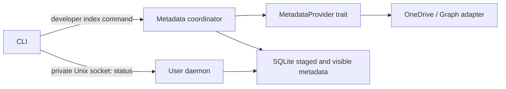

# Architecture

## Product contract

Cirrove should make remote files usable through ordinary Linux applications.
Previously indexed directories should be fast even while a provider is slow.
Content should arrive on demand, occupy a bounded disk cache and remain available
offline when pinned. Local saves must be durable before success is reported, and
cloud acknowledgement must have a separate visible state.

This avoids a full local mirror, but still requires metadata reconciliation,
content freshness checks, upload recovery and conflict handling. No HTTP cloud API
can provide instant uncached access or full local POSIX semantics.

## Implemented foundation

The daemon's status path does not contact providers. The development indexing
command uses the same store but is currently an explicit, one-shot operation.
There is no automatic job scheduler, D-Bus API or filesystem mount yet.

### Identity and linked libraries

A scope is `(account, provider, collection)`. For Graph a collection is a drive ID.
Within it, item IDs are identity; names and parent IDs are mutable presentation.
A shortcut carries a separate target drive/item pair. A path is never a cloud key.

The next OneDrive milestone must discover authorized linked drives, keep separate
delta cursors per target drive, project the selected shortcut subtree into the
namespace, handle duplicates/cycles and isolate revoked targets. Merely seeing a
shortcut in a root delta feed is not evidence that its target is tracked. This
milestone records links and does not traverse them.

### Atomic metadata refresh

`begin` resumes staged work or starts at a completed delta cursor. `stage` checks
the expected continuation, writes the page and advances its continuation in one
transaction. Visible rows remain unchanged until the terminal page commits the
staged changes and completed cursor together. A reset builds a new baseline next
to the visible one. Interrupted resets do not empty a previously usable index.

Last occurrence of an item wins within a feed round. Tombstones are metadata only;
there are no local dirty-file or upload states to delete. The future filesystem
projection must implement directory deletion ordering and protect dirty content.
SQLite uses WAL, FULL synchronous mode and a versioned schema. Staging consumes
disk proportional to the refresh, not an unbounded in-memory tree.

Do not hold database transactions across network awaits. The async coordinator
executes SQLite work on blocking workers. Status requests are bounded in time and
concurrency. Pagination pages have a byte limit. The initial full enumeration is
still required; the goal is to replace subsequent rescans with delta feeds.

### Provider transport

One persistent reqwest client per adapter instance reuses connections. Redirects
are disabled for authenticated metadata calls. Continuation URLs must remain on
the configured origin and drive. HTTP response bodies, tokens and opaque cursor
URLs are excluded from error messages. Graph 401/403/404/410 are distinct states.
429 and 503 set a shared cooldown using Retry-After (seconds or HTTP date).

There is no hidden retry loop. The future account scheduler must add bounded,
jittered retry policy for transient failures, honor cooldowns across all operation
classes, and avoid waking every mount at once. A cancellation token can interrupt
permit waits, authentication and HTTP body reads. RequestBudget reserves distinct
interactive/background concurrency; only background metadata operations exist today.
It is not yet a bandwidth scheduler or a guarantee about provider response latency.

### Authentication boundary

Adapters accept a TokenSource. StaticToken is for controlled developer testing only.
Production requires browser OAuth with PKCE, state validation, refresh serialization,
Secret Service storage, consent and selected-account identity verification. Own app
registrations and a project registration should be supported explicitly. Never reuse
another project's OAuth client identity as if it belonged to Cirrove.

## Planned filesystem and content engine

Use a Linux FUSE 3-compatible userspace adapter. Evaluate the Rust binding against
async cancellation, notification/invalidation and request scheduling needs before
selecting it. FUSE callbacks must not perform long network operations on a global
filesystem lock. Assign stable inodes independently of remote paths.

The next content contract should support version-bound ranged reads with a bounded
buffer, streaming to disk, coalesced concurrent requests and cancellation. Cached
ranges must be keyed by account, drive, item and content version; never combine
ranges from different versions. Provider download redirects need a separate client
that does not forward Graph bearer tokens to signed download hosts.

Before enabling writes, introduce a durable operation journal, local content fsync,
atomic commit records, provider conditional writes, resumable upload sessions,
crash replay and conflict copies. Define close/fsync behavior explicitly: a local
save can be durable while its upload is pending. Failure must remain visible.
Do not infer upload acknowledgement from a progress counter reaching 100%.

Nautilus badges, pin/unpin, thumbnails, tray and GTK4/libadwaita settings should use
one service-owned state model. File-manager presentation must not become a second
sync engine. Thumbnail reads are real reads: content prioritization and a thumbnail
policy are necessary to prevent background download storms.

## Provider expansion

- OneDrive first: documented Graph API, target-drive delta feeds and permissions.
- Google next: native Drive API, change tokens, shared-drive capabilities and
  explicit export semantics for Docs/Sheets. Push requires additional infrastructure;
  adaptive delta polling remains a valid desktop baseline.
- iCloud later: isolate the compatibility adapter and document authentication and
  API limitations. Do not promise parity with officially documented APIs.

## References

- [Graph delta](https://learn.microsoft.com/en-us/graph/api/driveitem-delta?view=graph-rest-1.0)
- [Graph throttling](https://learn.microsoft.com/en-us/graph/throttling)
- [Graph downloads](https://learn.microsoft.com/en-us/graph/api/driveitem-get-content?view=graph-rest-1.0)
- [Google push notifications](https://developers.google.com/workspace/drive/api/guides/push)
- [Apple CloudKit](https://developer.apple.com/documentation/cloudkit)
- [Rclone iCloud compatibility notes](https://rclone.org/iclouddrive/)
