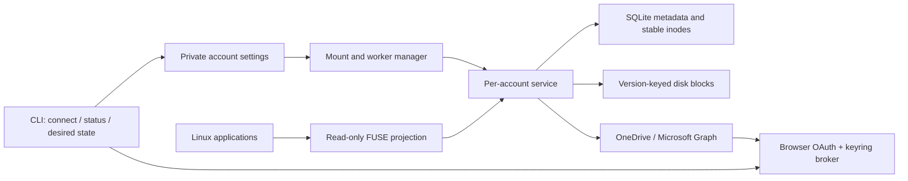

# Architecture

## Product contract and current boundary

Cirrove makes remote files usable through ordinary Linux applications. Cached
metadata should stay available when a provider is slow; file bytes arrive on demand.
The current implementation is a **read-only preview under validation**. It does not
upload through mounted paths, pin files or implement offline writes. A separate
upload journal and worker protect sealed edits, persist resumable Graph sessions
through the keyring, and reconcile uncertain attempts. They have synthetic HTTP and
crash coverage; live provider checks and writable filesystem integration remain in
progress. See
[durable local edits](adr/0002-durable-local-edits.md).

A cloud API cannot provide instant uncached access or complete local POSIX semantics.
The service reconciles metadata using delta polling (30 seconds by default); it does
not describe that interval as instantaneous real-time change delivery.

## Identity and linked libraries

A scope is `(account, provider, collection)`; Graph collections are drive IDs.
Item IDs are identity, while names and parents are mutable presentation. A shortcut
retains its target drive/item and target kind. Duplicate projections receive distinct
inodes, while cached bytes share the same remote identity and version. Directories
retain their inodes; regular-file inode keys additionally contain the content revision
and size to separate kernel pages belonging to different versions. A metadata-only
rename reuses the inode and bytes when a provider content tag is available.

Graph packages, such as OneNote notebooks, are projected as read-only child containers.
They have neither a file nor a folder facet; treating that as a malformed entry would
abort a whole delta page or directory. This projection does not implement OneNote
editing or claim compatibility with native notebook applications.

Discovery follows indexed ancestry and starts one delta worker per linked drive.
Reachable roots are persisted; obsolete subscriptions are removed only when the
remaining reachable scopes have complete indexes. Discovery stops at duplicate roots
and limits traversal to 256 roots. Projected ancestry detects cycles and excessive
depth. Invalid/cyclic entries currently produce generic projection warnings; polished
per-entry UI feedback is future work.

A failed linked-drive feed does not stop the primary drive. Cached metadata remains
last-known data. A folder shared without permission to enumerate its entire backing
drive may need foreground directory requests; this case is not claimed as verified
until tested with a real tenant. A cache is not proof of current remote authorization.

## Atomic metadata and foreground observations

The store stages paginated changes and advances the continuation in one transaction.
Visible nodes and the completed cursor change together only on the terminal page.
A replacement baseline is built alongside the last visible index. Interrupted work
resumes; an expired cursor does not immediately empty a usable directory tree.

Cold foreground listings are atomically recorded separately from the delta index.
A completed round removes observations older than its start, preserving newer
foreground results until a subsequent completed round. Old observed listings can
be refreshed in the background while their cached version remains readable.
Directory fetches have a total deadline and repeated-cursor/entry limits.

SQLite uses WAL and FULL synchronous mode. Network awaits never occur inside its
transactions. Database work runs on blocking workers. Shortcut discovery starts
at a partial index of actual links and follows their ancestors, so an idle poll
does not walk every file in a large library. Batched inode assignment avoids a
separate database transaction for every directory entry.

## Authentication and ownership

Microsoft authorization code flow uses PKCE S256, random state and nonce, a bound
loopback callback, explicit account selection and validated RS256 OIDC claims.
Issuer, audience, tenant, expiry and nonce are checked before an identity is accepted.
The CLI displays the verified identity and selected drive before saving it.

Non-secret configuration is atomically written and fsynced. Tokens are stored in a
Cirrove-labelled Secret Service item over an encrypted session, never in the metadata
database. Secret writes are explicitly set and read back through a fresh encrypted keyring
session before reporting success. A mismatched readback gets at most three write
attempts; lock and transport errors return to the caller. The shared account broker
serializes refresh, checks the refreshed Graph identity and persists rotation before returning a new access token. Delayed 401s
invalidate only the rejected token, not a newer grant.

A daemon ownership lock prevents competing managers. Per-account leases cover its
worker and filesystem lifetime. Reauthentication first disables that account and
waits for its lease. It verifies the same identity before replacing credentials.
Other accounts keep running. A killed login command can leave that account disabled;
`enable` is the explicit recovery action.

## Transport, responsiveness and content consistency

Persistent reqwest clients reuse connections. Authenticated Graph requests do not
follow redirects; continuation URLs must stay on the configured origin and drive.
Signed downloads use a separate client without Graph bearer headers. Provider bodies,
tokens, signed URLs and opaque cursor material are excluded from application errors.

Per account, there are four foreground metadata slots, four content slots, two
upload slots and one background metadata slot. Transfers cannot occupy directory
request slots. Upload fragments are bounded to 5 MiB and use a separate client that
neither follows redirects nor sends Graph bearer tokens to session URLs.
429/503 cooldown applies across metadata, download and upload operations. Requests and
credential operations have finite deadlines; account cancellation interrupts them.
The scheduler distinguishes authentication, permissions, missing items, expired
cursors, throttling and transient failures, and uses bounded backoff with jitter.

Content cache keys include account, drive, item, version, size and block offset.
Blocks are at most 4 MiB, while an individual read result is capped at 8 MiB. Four
loaders and eight in-memory cache blocks bound content buffering independently of the
remote file's total size; namespace and outstanding application buffers add memory.
A small failure cooldown prevents coalesced failures from becoming a retry storm.

Each uncached Graph range currently uses metadata checks before and after download.
The content revision and size must match the opened version. Cirrove prefers Graph's
content-only cTag and falls back to eTag when absent; the two tag namespaces are
distinct in cache keys. Response range and byte count are
validated before publication. This favors version consistency but adds **two Graph
metadata requests per uncached block**; real-provider latency measurements must guide
future optimization. A changed file yields ESTALE instead of mixing versions.

Blocks have SHA-256 checksums. Temporary bytes and the containing directory are
fsynced before publication is indexed. Startup removes interrupted temporary blocks,
accounts for orphaned publications and enforces quota. Corrupt blocks are fetched
again. Cached data survives restart, but unpinned blocks may be evicted: this is not
an offline-availability guarantee.

## FUSE and lifecycle

The pure-Rust `fuser` adapter uses the Linux FUSE protocol and `fusermount3`, without
libfuse development headers. Callbacks dispatch work to Tokio and keep namespace
locks short. Directory handles have stable listing snapshots. File handles bind a
content version. Ordinary read calls use kernel direct I/O. Mount initialization
requires `FUSE_DIRECT_IO_ALLOW_MMAP` to support shared read-only and private mappings;
mapping pages occupy kernel/application memory in addition to Cirrove's block cache.
The disk quota is not a limit on total kernel or application memory.

Metadata commits invalidate known paths and attributes. Pages of an older file inode
remain associated with that revision, so an existing mapping never silently reads
bytes from its replacement. An uncached old block cannot be retrieved after the
provider changes that file: reads return ESTALE, and a failing mapped page fault may
deliver SIGBUS to the application. Historical-version downloads are not implemented.
Already cached old bytes remain readable while retained; cache eviction is still
possible. This does not guarantee indefinite snapshots of open files.

The filesystem admits at most 1,024 content requests and runs 32 at a time. Additional
admitted reads await capacity asynchronously for at most 30 seconds; queue expiry is
ETIMEDOUT and admission overflow is EAGAIN. Account cancellation releases active and
queued reads with ENODEV. Content loaders remain limited to four. Metadata requests
have a separate 128-slot budget, so content contention does not consume those slots.
Namespace views are currently retained until unmount; long-session namespace growth
must be measured separately from the bounded content cache.

This first projection has read-only permissions and rejects write opens. File-manager
thumbnail generation still causes real content reads; reserved metadata capacity
prevents those requests from consuming folder-request slots. Thumbnail policy,
pinning and per-file status presentation remain later desktop work.

The manager retains running accounts if settings or mount-state observation fails.
Every mount attempt checks for an empty real directory outside other FUSE mounts.
It never mounts over local files deposited after an ejection. Enabled accounts are
remounted after accidental ejection; `disable` records an intentional unmount.
Shutdown cancels and awaits workers, then unmounts and joins FUSE sessions.

After a process crash, startup checks a stale control socket under the daemon's
ownership lock and removes it only when a connection is refused. A disconnected
FUSE mount is detached only if its filesystem type and account UUID match and
the kernel reports ENOTCONN. A live mount is never displaced. Kernel tests kill
a synthetic mount process and verify that a new manager serves readable files.
These checks do not imply that a full-machine power-loss test has passed.

## Conditional namespace changes

The provider-neutral mutation contract supports folder creation, rename/move within
one collection, and conditional regular-file removal. Rename/move sends the original
ETag and refuses destination collisions. File removal checks the remote file facet
and original ETag before issuing a conditional DELETE; a fabricated local file type
cannot turn this path into recursive folder deletion. Shortcuts and root changes
are rejected by the current mutation contract.

Upload-journal schema 3 adds namespace records and a shared sequence/resource queue.
Metadata changes cannot overtake pending uploads on the same remote identity;
source/destination name reservations also order colliding creates and moves.
Case folding is a conservative queue exclusion, not a definition of the provider's
filename equivalence. Receipts and queue completion commit together. Migration
preserves existing upload sequence numbers, snapshots and pending states. Older
binaries refuse schema 3 instead of trying to downgrade it.

After interruption, a namespace operation requires verification. A matching immutable
item at the requested new name/parent can complete a lost rename/move response.
An unchanged original revision permits a new conditional attempt. A missing item
alone does not establish deletion: lost deletes and unidentified folder creations
can enter `NeedsReview`, retaining their request without an automatic retry loop.
HTTP success is required for a confirmed deletion receipt. File DELETE uses the
provider's recycle-bin behavior; it is not permanent deletion or local POSIX rmdir.

These operations remain outside the mounted filesystem. The writable namespace
layer must add ancestor/dependency handling, application-save generations and safe
replacement semantics before enabling folder mutations through FUSE. Personal
accounts, permissions changes and broader live concurrency still require coverage.

## Next boundaries

Before enabling writes, connect the local upload journal to application-save
ordering, conditional writes, resumable uploads and conflict preservation. The
standalone journal tests do not prove writable filesystem semantics. Separate
local-save success from remote acknowledgement. GTK settings, tray and Nautilus integrations
must consume the service's state rather than maintain their own sync logic.

Google Drive will implement provider contracts around its native changes and content
APIs, including shared drives and explicit document export. iCloud must stay isolated
behind a compatibility adapter with visible authentication/API limitations.

## References

- [Microsoft authentication code flow](https://learn.microsoft.com/en-us/entra/identity-platform/v2-oauth2-auth-code-flow)
- [Graph delta](https://learn.microsoft.com/en-us/graph/api/driveitem-delta?view=graph-rest-1.0)
- [Graph throttling](https://learn.microsoft.com/en-us/graph/throttling)
- [Graph conditional move](https://learn.microsoft.com/en-us/graph/api/driveitem-move?view=graph-rest-1.0)
- [Graph conditional deletion](https://learn.microsoft.com/en-us/graph/api/driveitem-delete?view=graph-rest-1.0)
- [Graph downloads](https://learn.microsoft.com/en-us/graph/api/driveitem-get-content?view=graph-rest-1.0)
- [Graph content and metadata tags](https://learn.microsoft.com/en-us/graph/api/resources/driveitem?view=graph-rest-1.0)
- [Graph packages](https://learn.microsoft.com/en-us/graph/api/resources/package?view=graph-rest-1.0)
- [Graph child containers](https://learn.microsoft.com/en-us/graph/api/driveitem-list-children?view=graph-rest-1.0)
- [Linux FUSE I/O and memory mapping](https://docs.kernel.org/filesystems/fuse/fuse-io.html)
- [Google change tracking](https://developers.google.com/workspace/drive/api/guides/manage-changes)
- [Apple CloudKit](https://developer.apple.com/documentation/cloudkit)
- [Rclone iCloud compatibility notes](https://rclone.org/iclouddrive/)
