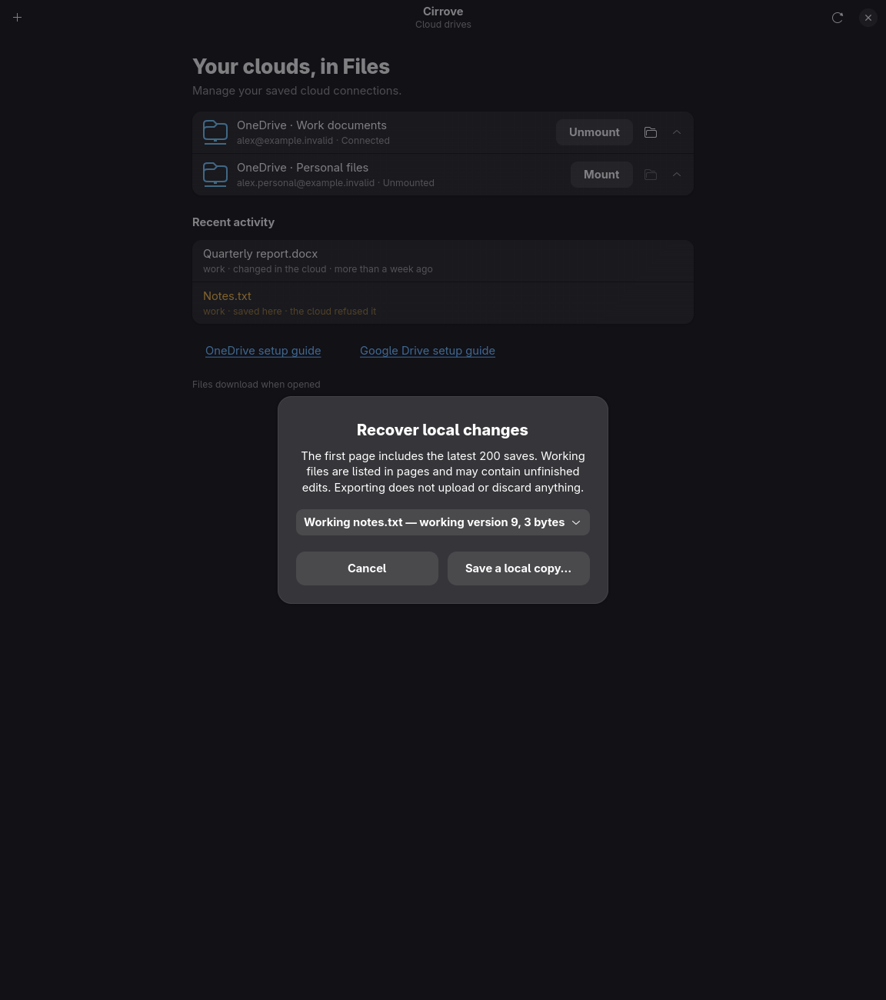
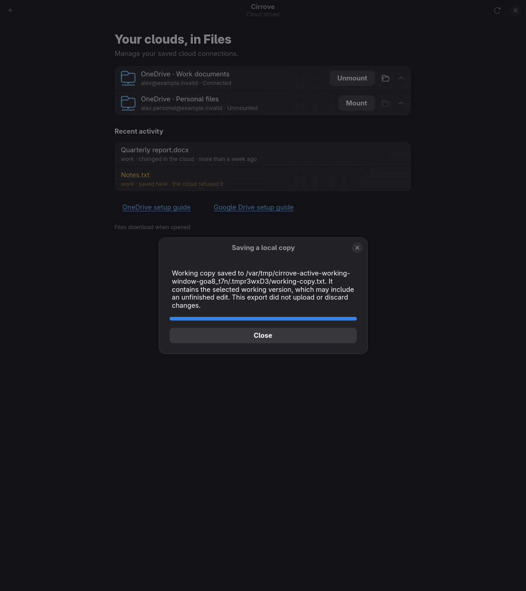

# Active working-file recovery in the desktop

The recovery picker now combines identified unresolved saved versions with active
working-file selections. Saved history is explicitly limited to the latest 200
entries on the first page; working metadata pages can advance past clean records,
even when the current page has no eligible selection. Older/unavailable working
routes leave saved recovery available with a visible explanation. An active export
never falls back to offline journal access.

Selection dispatch preserves source kind. The destination chooser is followed by
a current account/mount/access check; the daemon validates the generation. Progress
polls the accepted job under the account identity. Success requires the exact
selected source, generation, byte size, destination and receipt kind. Missing,
stale, stopped or contradictory receipts never display success. Both active and
offline pickers share selection labels without sharing journal access paths.

## Validation

Desktop library tests: 25 passed. Recovery presentation tests: 6 passed, including
empty page progression, old-route fallback, exact working-generation/job checks
and dual-receipt refusal. The first negative control was invalid because its new
fixture omitted required Job.name; both that failed run and first contract failure
are retained. After correcting the fixture, removing only the sealed receipt's
working-receipt exclusion failed at the intended refusal assertion (exit 101).
Restoring the check passed all six tests.

Logs:
- `.local-state/icloud-active-working-desktop-unit.log`
- `.local-state/icloud-active-working-desktop-red.log` (invalid fixture)
- `.local-state/icloud-active-working-desktop-contracts.log` (same fixture defect)
- `.local-state/icloud-active-working-desktop-red-2.log` (meaningful negative control)
- `.local-state/icloud-active-working-desktop-contracts-2.log` (six passed)

All 16 native window scenarios passed, 2026-10-01 05:37:26–05:37:46 UTC.
The two new scenarios cover empty pages/older services and correct, missing,
stale and stopped working-export outcomes. Manifest/log:
`.local-state/active-working-window-2026-10-01/`; private TMPDIR/SQLITE_TMPDIR
`/var/tmp/cirrove-active-working-window-goa8_t7n` on btrfs. These windows use a
synthetic service socket; actual held-file FUSE/socket/CLI export is recorded
[separately](icloud-active-working-export-service-2026-10-01.md).

## Visual inspection

Both native captures were opened and inspected: readable wrapping, distinct source
kind/version/size, usable action buttons, and selected-version confirmation with
no claim to upload or discard source edits. The examples contain synthetic data.

No ordinary daemon, installed account grant or user file was changed. Installed
GUI acceptance and iCloud live reliability remain open; these tests establish the
local recovery interface, not full iCloud support.

The first complete check stopped on clippy's needless borrow in the new screenshot
helper, after native rendering had passed. The redundant borrow was removed;
no UI behavior or image content changed. The failed manifest/log remain in
`.local-state/icloud-active-working-desktop-check-2026-10-01/`.

The second full check passed Rust and filesystem tests but stopped at the translation
completeness gate (seven new messages missing from the catalogue). The template
was regenerated and all seven German translations reviewed and supplied. Evidence:
`.local-state/icloud-active-working-desktop-check-2-2026-10-01/`.

The complete `scripts/check.sh` passed on 2026-10-01, 05:47:49–05:53:17 UTC
(exit 0), including formatting, clippy, workspace and kernel filesystem tests,
script/translation checks and acceptance ledger. Manifest/log:
`.local-state/icloud-active-working-desktop-check-3-2026-10-01/`.
