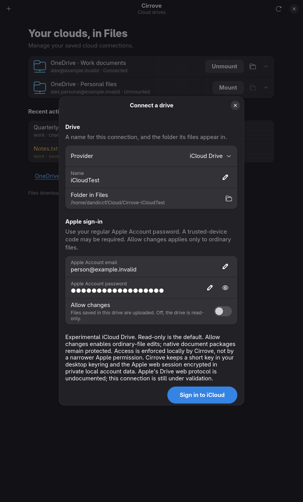
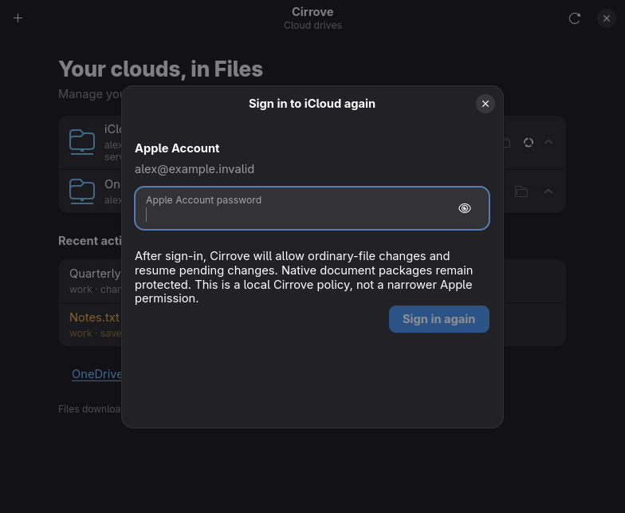

# Explicit native iCloud access workflow

Registered before execution. Question: can an explicit selected local access
policy survive native password/2FA stages and durable account completion while
ordinary reauthentication preserves the original mode? Prediction: capturing
account identity and requested mode before login, freezing connection fields
across 2FA and revalidating the exact account at completion avoids stale changes.

First stage retains the Settings RW release gate. Tests cannot prove successful
ordinary RW login while this gate remains; they must still refuse it, before
new credential writes. Exposing the choice in a private uninstalled build is
not installed acceptance. Later enablement and owned live arms remain required.

Synthetic fixtures only: no Apple authentication or real credentials. Targeted
Accounts/CLI/model tests, native dialogs using fake status, and complete window
suite. Negative controls: discard requested mode at durable completion; remove
provider-switch reset to RO; discard explicit mode before reauth dialog. Require
each selected regression to fail at its intended assertion, then restored tests
to pass. Observe cancellation/settings bytes, foreign identity, stale account,
credential persistence before/after failed settings publication. Private btrfs
TMPDIR/SQLITE_TMPDIR and dedicated target; all runs serial.

## Results, 2026-10-01

The Accounts suite passed 27 tests, CLI access suite 2 tests, desktop Accounts
suite 15 tests, and native window suite 20 tests. Translation generation compiled
278 German messages; all 4 translation tests passed. Run manifests and logs are
retained under `.local-state/icloud-access-*-2026-10-01/`.

The durable-completion and provider-reset negative controls failed at the intended
assertions. The first reauth-mode negative is not evidence: the restored window
suite also failed because the test checked labels before they were mapped. After
waiting for the local-policy label, `reauth-mode-red-2` failed at the intended mode
assertion, and `windows-green-2` passed all 20 scenarios.

Initial screenshots were clipped by the synthetic window size. Test-only capture
sizes were corrected. An attempted Xvfb capture could not launch because Xvfb was
absent; no software was installed. Native `screenshot-green-2` passed both capture
scenarios. The resulting connect and reauth screenshots were visually inspected:
all fields, access explanations and submission buttons are visible without clipping.
These use synthetic accounts and credentials, not a successful Apple login.

At this initial stage the Settings write gate remained closed. Full check, ordinary writable login, real
application arms and installed acceptance remain outstanding for these changes.

## Additional cancellation review

Independent review found that dropping the connect future during credential
readback could leave an unreferenced sealed session. The revised helper owns the
persistence task through readback and cleanup. If the caller has cancelled before
settings publication begins, it removes only credentials confirmed unreferenced
under the settings lock; uncertain publication still retains them. A credential
save error now also reaches this reconciliation path. Publication is the synchronous
commit boundary: cancellation after it begins may complete that commit. Runtime
termination is not made transactional by this change.

Two synthetic tests were added for normal completion and cancellation at a blocked
vault readback (both successful and failed readback). Their execution and negative
controls are pending while the exclusive application arm runs. Earlier passing
Accounts results predate this additional change.

## Ordinary write gate change, pending full acceptance

Both independently owned actual application arms passed; see
[application evidence](icloud-real-applications-acceptance-2026-10-01.md). The
Settings restriction to RO was removed after those terminal results. All six
iCloud identity constraints, default RO behavior, context-bound writer requirement,
native package protections and permanent-delete refusal remain. This is a source
change under validation, not an installed acceptance result.

Two cancellation negatives failed as intended: omitting the closed-receiver check
left the cancelled credential save uncleared; restoring early `vault.save(...)?`
left the failed-readback arm uncleared. Correct implementation was restored before
applying the opt-in patch. Logs are `icloud-access-cancellation-red-2026-10-01`
and `icloud-access-readback-cleanup-red-2026-10-01`.

The new real FUSE manager lifecycle scenario failed with the old Settings gate
(`invalid read-only iCloud Drive`). Corrected gate tests and both-mode cancellation
coverage are running. The lifecycle uses injected synthetic providers: it proves
manager/access/recovery behavior, not Apple transport.

All 30 Accounts tests passed after opt-in enablement, including the expanded
mode matrix and both-mode cancellation controls. The real FUSE iCloud
RO→RW→RO manager test passed (16.11 seconds in-test) after failing under the
old gate. No Apple calls occur in that manager fixture.

## Open pre-installation boundary

Independent audit found that unknown-extension native FILE packages may still
be projected as ordinary files. Worker-side Data/Package verification refuses
destructive cloud operations, but local unlink/replace/rename acceptance can
precede that refusal. This violates the registered pre-admission package boundary.
Installation and user-facing write release remain held until selected-file
representation is verified before local destructive acceptance, without downloading
content or probing every file during directory listing. The source gate change
alone does not close that requirement.

Selected-file admission is now implemented and has targeted provider/FUSE
coverage, including unknown-extension packages, alias binding races, existing
working-file opens and pathname truncation. Removed-guard controls failed before
the corrected scenarios passed; see [admission evidence](icloud-selected-write-admission-2026-10-01.md).
The original two actual-application arms predate that hook. Combined live and
installed acceptance remain open; targeted synthetic success does not close them.

Full `scripts/check.sh` passed on 2026-10-01, 08:04:45–08:13:13 UTC
(`.local-state/icloud-access-fullcheck-optin3-2026-10-01`). This includes formatting,
Clippy, workspace/feature tests, actual synthetic kernel mounts, script tests,
translations, ledger and docs. Rustdoc retained one pre-existing broken private
link warning in engine.rs; it was not a check failure. Native window scenarios
were checked separately earlier; neither result establishes installed acceptance.
