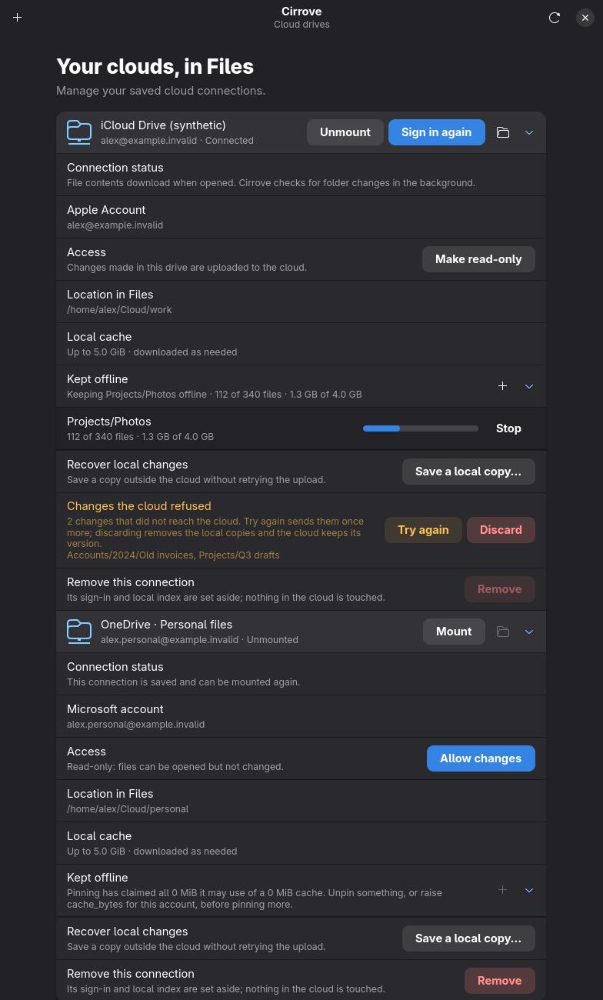

# Separate irreversible deletion from ordinary iCloud writes

Registered before tests. Question: will a future writable iCloud account keep
permanent deletion unavailable, including callbacks retained from an older card?
Prediction: a separate explicit provider capability checked at chooser, confirm
and dispatch prevents any iCloud deletion request while OneDrive/Google retain
their supported route. This does not enable iCloud writes or permanent deletion.

Synthetic model tests and native GTK fake-socket scenario only. No real account
or cloud calls. Negative control: remove dispatch guard and require the native
scenario to detect blocked.txt being sent; restore and run complete window suite
and model tests. Require supported-provider positive control. Private disk
TMPDIR/SQLITE_TMPDIR, dedicated target, serial runs, complete scripts/check.sh
before committing. Status: focused tests passed; full repository check passed.

## Results

Both model tests passed. The first native negative reached a downstream positive
control timeout because the forbidden in-flight request occupied the operation
slot. The fixture was strengthened to observe forbidden dispatch directly before
the positive control. The second negative failed with “stale iCloud action
dispatched a permanent deletion”. Restoring the guard passed all 19 native
window scenarios (06:51:13–06:51:42 UTC), including the supported-provider
positive control. No real deletion occurred: all requests used a fake local
service. The GTK accessibility-bus warning did not fail the scenarios.

Retained manifests/logs: `.local-state/folder-create-delete-model-green-2026-10-01/`,
`folder-create-delete-window-red-2026-10-01/`,
`folder-create-delete-window-red-2-2026-10-01/`, and
`folder-create-delete-window-green-2026-10-01/` under the same `.local-state/`.

The rendered synthetic writable iCloud card was visually inspected: account,
access, local recovery and pin controls remain readable, with no permanent-delete
row. This is deliberately a future-mode synthetic card, not installed acceptance
or proof that the ordinary iCloud write gate has been opened.

## Complete repository check

`scripts/check.sh` passed on 2026-10-01, 06:52:26–07:00:24 UTC (exit 0),
including workspace/feature tests, real kernel mounts, script checks and docs.
The native window suite passed separately as recorded above. Private manifest
and log: `.local-state/icloud-folder-delete-check-2026-10-01/`; temporary storage
was private btrfs. Ordinary installed services and cloud data were untouched.
