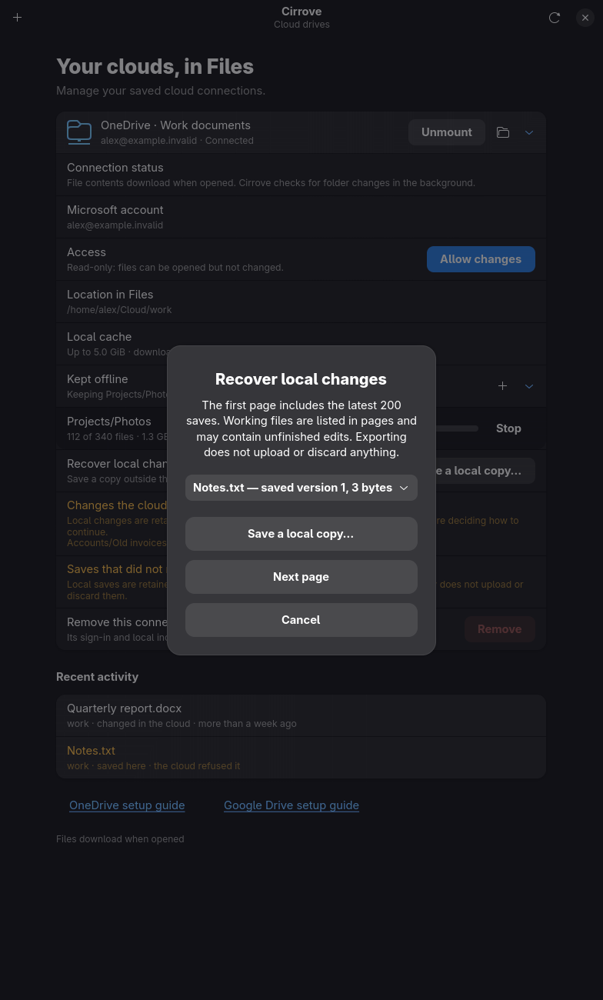
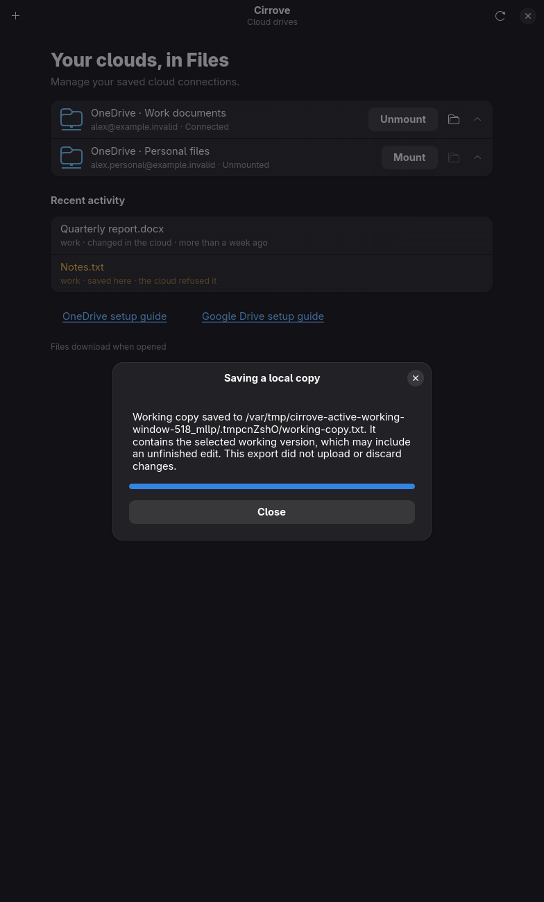

# Local recovery on enabled read-only accounts

Recovery uses the existing read-only journal, holds account and journal ownership
through blocking copies, and never constructs write workers, seals files or replays
operations. Missing journals return empty metadata without creating one; busy or
invalid journals produce visible errors. Listing uses bounded local names from
the journal and existing metadata index, falling back to identity only when absent.
The desktop capability permits local copies while mutation entry points remain
writable-only. Source generation and exact result receipts remain mandatory.

## Controlled lifecycle question and prediction

Can a real writable mount downgrade to read-only while retaining a sealed conflict
and dirty unlinked working bytes, then export both through the daemon socket?
Prediction: the current writer-only recovery route fails after downgrade; the new
local-only owner permits both copies without changing journal data or restarting
writes. Register the following exact fixture before executing it:
`real_manager_readonly_downgrade_exports_retained_saved_and_dirty_bytes`.

Run a prebuilt test binary with its SHA-256 recorded, ignored/exact/single-threaded,
a private disk-backed TMPDIR/SQLITE_TMPDIR and a 120-second deadline. The fixture
retains its directories even on failure. Both success and failure logs stay intact.
It checks kernel EROFS, exact saved and working receipts/bytes, unchanged journal,
a single write-factory invocation and stable provider mutation/upload counters
through export and a further manager refresh. This synthetic provider/kernel
lifecycle is not a live Apple-account downgrade or installed GUI acceptance.

## Completed evidence

- Core negative control omitted directory retention and failed the descriptor
  lifetime assertion. Restored core: all 22 working-export tests passed.
- Manager negative attempts 1/2 were invalid evidence: first a SHA formatting
  compile error, then a cache fixture below the block-size minimum. Both corrected.
  Attempt 3 removed RO resolution and failed at the absent-writer refusal.
  Restored manager: all six recovery tests passed.
- Native UI negative control restored the writable-only picker guard; the RO
  picker scenario failed at its expected visible-picker condition.
- First complete window run: 15 passed, three failed. Two reused GTK application
  IDs in shared helpers; one detected a missing count in the RO uncertainty text.
  Distinct IDs and the translated count fixed these. All 18 native scenarios then
  passed, 2026-10-01 06:26:12–06:26:40 UTC. Both captures were opened and inspected:
  readable wrapping, usable buttons, read-only state and no mutation actions.

Logs/manifests:
- `.local-state/icloud-readonly-core-{red,green}.log`
- `.local-state/icloud-readonly-manager-red{,-2,-3}.log`
- `.local-state/icloud-readonly-manager-green.log`
- `.local-state/readonly-recovery-window-red-2026-10-01/`
- `.local-state/readonly-recovery-window-2026-10-01/`
- `.local-state/readonly-recovery-window-2-2026-10-01/`

## Kernel lifecycle result

The negative arm failed at the expected RO journal refusal after a real downgrade
(06:28:33–06:28:38 UTC). The restored route passed the same exact test
(06:29:52–06:30:03 UTC): kernel writes returned EROFS, the sealed save and dirty
unlinked generation exported with matching bytes/hashes/receipts, the journal
stayed unchanged and provider write counters stayed stable across another manager
refresh. Only one write factory was constructed. Both binaries and retained
fixture roots are recorded in the [public manifest](icloud-readonly-recovery-fuse-2026-10-01.json).

Installed Apple-account downgrade acceptance remains separate and open.

The first full check stopped at clippy on a redundant `Ok(...?)` in the new
manager route. Removed the redundant wrapping; behavior is unchanged. Failed
manifest/log: `.local-state/icloud-readonly-recovery-check-2026-10-01/`.

The second full check also stopped at clippy: eight test-only Option unwraps,
a needless fstatfs borrow and a nested conditional. Replaced the unwraps with
fixture-specific expectations and applied the suggested equivalent forms.
Failed manifest/log: `.local-state/icloud-readonly-recovery-check-2-2026-10-01/`.

## Complete repository validation

`scripts/check.sh` passed on 2026-10-01, 06:36:17–06:44:13 UTC (exit 0),
including formatting, clippy, workspace/feature tests, real kernel mounts, scripts
and documentation. Manifest/log: `.local-state/icloud-readonly-recovery-check-3-2026-10-01/`.
Both temporary-directory variables used private btrfs storage. Native window
acceptance is recorded separately in the read-only recovery benchmark. This is
worktree validation; the ordinary installed daemon was not replaced.
